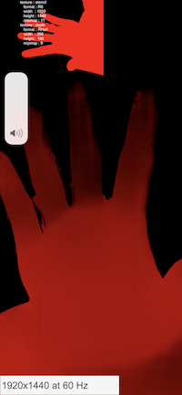

# Depth and Stencil Demo

Depth + body segmentation demonstrated in Unity using Ar Foundation.




Left: segmentation buffer combined with depth buffer, Right: dilated depth buffer


Segmentation buffer combined with depth buffer, colors converted to greyscale with (red, red, red, 1)

[Link to xcode build](https://drive.google.com/drive/folders/1DsIUwO-p_pk4ucrqvKbU_X7y4glfgSVx?usp=sharing)

## Settings for AR frame resolution
You can set the resolution settings for the segmentation under the AR Session Origin element:


## Relevant Files
- [PostEffect.cs](https://github.com/khanniie/Unity_Depth_Seg/blob/master/unity-project/Assets/DepthAssets/script/PostEffect.cs): Grabs the buffers from the AR Occlusion Manager and sends them to the shader
- [StencilSample.shader](https://github.com/khanniie/Unity_Depth_Seg/blob/master/unity-project/Assets/DepthAssets/shader/StencilSample.shader): This is where the textures are combined according to this code:

```CS
// get segmentation buffer
fixed4 stencil = tex2D(_StencilTex, GetStencilUV(i.uv));

// get depth value
fixed4 depth = tex2D(_DepthTex, GetStencilUV(i.uv));

// depth values represent meters from camera
// we clamp this to between 0 to 1, 
// then we make sure the value is at least 0.1 so the hand shows up 
float d = 0.1 + 0.9 * (1 - clamp(depth.r, 0, 1));

//combine segmentation and modified depth
float r = stencil.r * d;
return float4(r, r, r, 1);
```

## Sending to Xcode
It's suggested that you fill out the settings in Player Settings -> Identification. For the signing team id, follow the instructions here (the last answer at the bottom is the one that worked for me), in order to be able to "Build and Run" the project, which speeds up the produciton process.


### Licence

* credits for base code to Kitasenju design's [MEISAI](https://kitasenjudesign.com/meisai/)
* MIT
